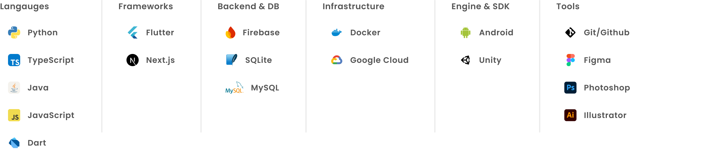
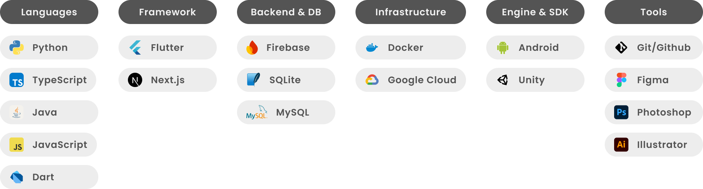

<!--
Profile README (GitHub renders this repository's README on your profile)
Tip: Keep layout mobile-friendly (avoid wide multi-column tables).
-->

# **Front & Back End Engineer / UX-UI Designer**

とにかく「作る」ことが好き。 
個人開発を含めてアプリ開発・サーバー運用・自動化・ゲーム制作などを行ってきました。

## Quick Links

  <!-- <a href="https://nakamura-johnielo-portfolio.vercel.app/">
    &nbsp;Portfolio
  </a>
  &nbsp;&nbsp;|&nbsp;&nbsp; -->
  <a href="https://github.com/nakamura-johnielo/my_dic">
    &nbsp;My Dic (Repo)
  </a>
  &nbsp;&nbsp;|&nbsp;&nbsp;
  <a href="https://my-dic-flutter-portfolio.firebaseapp.com/">
    &nbsp;My Dic (Demo)
  </a>

---

## Highlights

- アプリの UX/UI 設計と実装（Flutter / Web）
- Google Cloud Compute Engine + Docker でのサーバー運用（独自ドメイン・HTTPS）
- Python / AI を使った業務自動化（スクリプト・ツール化）

---

## Featured Projects

### My Dic — スペイン語学習アプリ

- Links: [Repo](https://github.com/nakamura-johnielo/my_dic) / [Demo](https://my-dic-flutter-portfolio.firebaseapp.com/)
- Stack: Flutter / Firebase / SQLite
- Notes: デバイス間リアルタイム同期、ログイン機能

### Self-hosted Server — 個人サーバー運用

- Platform: Google Cloud Compute Engine
- Infra: Docker / Domain / HTTPS
- Notes: メモアプリ連携など、リアルタイム同期用途で運用

### Portfolio Site

- Link: https://nakamura-johnielo-portfolio.vercel.app/
- Stack: Next.js
- Status: 開発中（一部掲載）

### Others

  
Open

- **CLI tools**: クリーンアーキテクチャの雛形生成 / 画像一括書き出し / PDF・画像関連
- **Apps**: Android キーボード / Android 辞書 / ファイルコンバータ / Python 自動化ツール
- **Web 練習**:
  - https://nakamura-johnielo.github.io/men-dofu-website/
  - https://vape-shop-demo-darktheme.vercel.app/
  - https://vape-shop-demo.vercel.app/
  - https://leones-manager-app.vercel.app/
  - https://unbirthday-color.vercel.app/

---

## Skills
<!--  -->

---

## Experience

### デザインファーム (2024–2025)

- グラフィック / UX-UI デザイナー
- アプリの UX/UI 設計、社内業務の自動化、Slack 連携

### ペット系ベンチャー企業 (2023–)

- エンジニア
- 店舗運営の最適化・DX、ツールのプロトタイプ、Web 制作

---

## Contact

  <a href="mailto:nakamura-johnielo@gmail.com">
    &nbsp;nakamura.johnielo@gmail.com
  </a>

